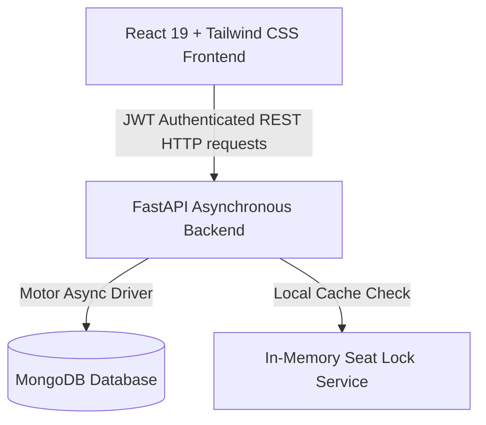
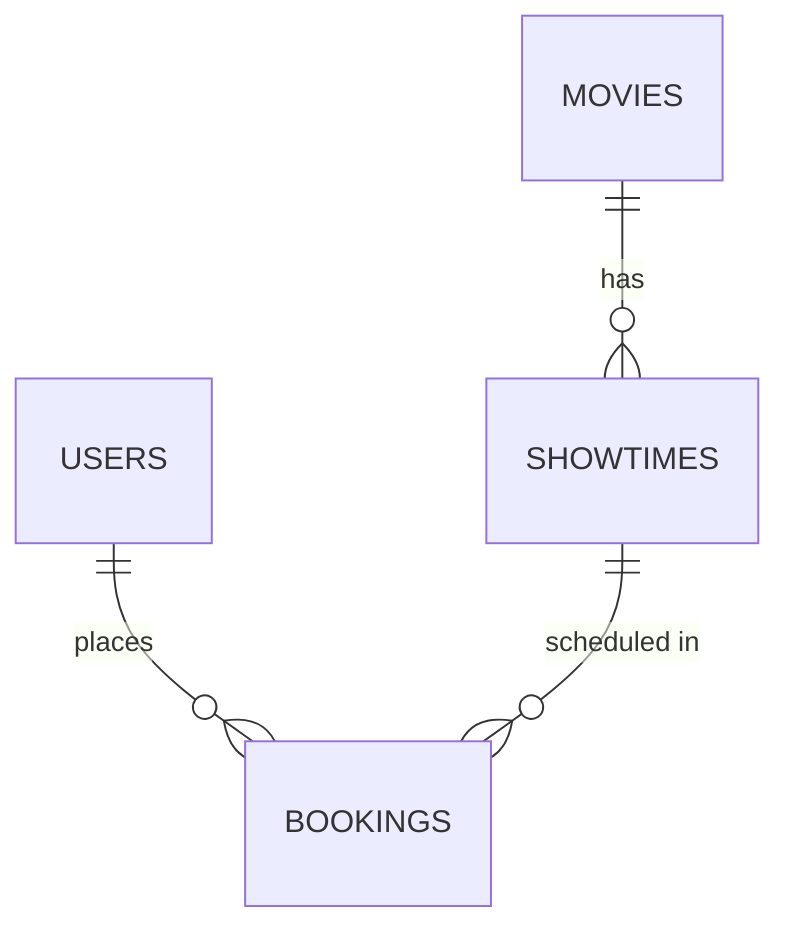

# PROJECT REPORT
## BOOKTICKET: A FULL-STACK MOVIE TICKET BOOKING SYSTEM

---

### **1. Cover / Title Page**

* **Project Title:** BookTicket: A Full-Stack Movie Ticket Booking & Management Platform
* **Course Name:** Bachelor of Technology / Computer Science & Engineering (Final Year Project)
* **Academic Year:** 2025 - 2026
* **Submitted By:**
  * **Student Name:** Sumit Kumar
  * **Roll Number / Enrollment No:** [Insert Roll Number Here]
  * **Department:** Computer Science & Engineering
* **Submitted To:**
  * **Professor / Sir Name:** [Insert Professor Name Here]
  * **Designation:** Department of Computer Science & Engineering
* **Institution:** [Insert College/University Name Here]

---

### **2. Certificate**

This is to certify that the project report entitled **"BookTicket: A Full-Stack Movie Ticket Booking & Management Platform"** is a bonafide work carried out by **Sumit Kumar** under my guidance and supervision in partial fulfillment of the requirements for the award of the degree.

The results embodied in this project report have not been submitted to any other University or Institute for the award of any degree or diploma.

<br>

**__________________________**  
**Project Guide / Supervisor**  
Department of Computer Science & Engineering  
[Institution Name]

**__________________________**  
**Head of Department (HOD)**  
Department of Computer Science & Engineering  
[Institution Name]

---

### **3. Acknowledgements**

I would like to express my deepest gratitude to my project guide, **[Professor's Name]**, for their valuable guidance, constant encouragement, and constructive feedback throughout the development of this project.

I am also thankful to our Head of Department, **[HOD Name]**, and the institution administration for providing us with the necessary computational facilities and resources that made this project possible.

Lastly, I extend my thanks to my peers, family, and friends who supported and motivated me directly or indirectly during this development journey.

---

### **4. Abstract / Executive Summary**

**BookTicket** is a modern, responsive, and secure full-stack web application developed for online movie ticket reservations and cinema theater administration. Built using a decoupling architecture with a **FastAPI (Python)** backend and a **React 19 (JavaScript)** single-page frontend, the platform provides seamless seat reservations, real-time booking management, and live administrative insights. 

The application utilizes **MongoDB** as its primary NoSQL database due to its flexible, document-based schema model which is ideal for storing movies and multi-dimensional showtime layouts. To ensure continuous availability during testing, a resilient offline fallback mechanism is implemented to switch to an in-memory database store if the main database instance is offline. Key features include JWT token-based authentication, a 5-minute concurrent seat lock manager to prevent double booking, simulated payment checkouts, dynamic E-ticket pass generation with scannable QR codes, and a comprehensive admin KPIs dashboard.

---

### **5. Problem Statement**

#### **The Core Problem**
In traditional offline movie ticket booking systems, customers face long queues, manual errors, and a complete lack of real-time seat choosing capabilities. Conversely, existing online systems often suffer from key limitations:
1. **Lack of Concurrency Control:** If multiple users select the exact same seat concurrently, systems without proper reservation locking fail, resulting in double-booked seats and poor customer satisfaction.
2. **Heavy Database Overhead:** Poorly structured relational databases struggle with high-frequency checkouts, leading to application lag during peak movie releases.
3. **Rigid Admin Controls:** Theater managers lack simple interfaces to update movie lists, manage screening slots, or review real-time sales metrics.
4. **Poor UI/UX Across Devices:** Many platforms are not optimized for mobile browsing, restricting users from booking tickets on-the-go.

#### **How BookTicket Solves These Problems**
* **Concurrency Protection (Seat Lock Engine):** BookTicket resolves concurrent booking conflicts by implementing a temporary 5-minute seat lock in-memory service. When a user enters the checkout screen, their selected seats are locked and unavailable to other users. If the payment is completed, the seats are permanently marked booked; if not, the lock automatically expires, and the seats return to the available pool.
* **Asynchronous API Architecture:** By leveraging **FastAPI** (an asynchronous Python framework), the server handles concurrent connections efficiently with minimal resources.
* **Flexible Document Schema:** The **MongoDB NoSQL database** stores nested showtime schemas, allowing rapid queries for seat matrices without complex relational joins.
* **Dynamic Dashboards:** The application provides distinct portals—a user portal for active tickets and a custom admin analytics dashboard tracking key metrics like total revenue, tickets sold, and revenue breakdowns.

---

### **6. Project Objectives**

The main objectives of the **BookTicket** platform are:
1. **To Design a Secure User Authentication System:** Implement JSON Web Tokens (JWT) and `bcrypt` password hashing to secure accounts and maintain user sessions safely.
2. **To Build an Interactive Seat Selection Interface:** Create a dynamic visual grid for selecting seats (differentiating Standard and VIP seats) with real-time status representation.
3. **To Implement Concurrency Rules:** Mitigate race conditions and prevent double-booking issues through temporary holding states.
4. **To Deliver an Administrative Management Panel:** Provide cinema administrators with full CRUD controls over movies, showtime schedulers, and analytical dashboard indicators.
5. **To Ensure High System Availability:** Construct a database manager with a zero-downtime offline fallback mechanism for development and testing.

---

### **7. Features List**

The application is structured into the following operational features:

* **Authentication & User Management:**
  * User Registration and Login.
  * Secure password storage using `bcrypt` encryption.
  * JWT Bearer Token validation for secure API routing.
  * Role-Based Access Control (RBAC) separating `User` and `Admin` permissions.
* **Catalog Discovery:**
  * Live catalog search by title.
  * Filters for genre (Action, Sci-Fi, Drama, etc.) and availability status (Now Showing vs Coming Soon).
  * Movie detail pages displaying cast, synopsis, duration, and embedded YouTube trailer streams.
* **Interactive Seating Engine:**
  * Showtime schedule selection by date and format (IMAX, VIP Atmos, Standard).
  * Dynamic grid map layout (Rows A to H, Seats 1 to 12) featuring real-time statuses (Available, Selected, Reserved, VIP).
  * 5-minute seat locking system.
* **Checkout & Ticketing:**
  * Order breakdowns including subtotal fees and promo code logic (e.g., `CINEMA10` for a 10% discount).
  * Card, UPI, and Wallet payment simulations.
  * Instantly generated digital E-Tickets containing scannable base64 QR codes and booking reference IDs.
* **Admin Dashboard & Management:**
  * Summary cards showing metrics: Total Revenue, Tickets Sold, Active Movies, Registered Users.
  * Dynamic graphical charts illustrating sales distribution per genre.
  * Form controls to add/edit/delete movies and schedule showtime slots.

---

### **8. Technology Stack**

The project is built on the following modern software stack:

| Component | Technology | Description |
| :--- | :--- | :--- |
| **Frontend** | React 19 (JS) | Single Page Application (SPA) framework for dynamic UI updates and fast page transition rendering. |
| **Styling** | Tailwind CSS | Utility-first CSS framework for custom, premium responsive layouts. |
| **Backend** | FastAPI (Python) | High-performance asynchronous ASGI web framework for REST API routing. |
| **Database** | MongoDB | Primary NoSQL document-based store for flexible JSON structures. |
| **Auth & Security** | JWT & Bcrypt | Bearer tokens for session control; salted password hashing for database protection. |
| **Tools** | Git, VS Code, Postman | Version control, development environment, and API testing suite. |

---

### **9. System Architecture**

The system employs a client-server architecture model where the React application communicates with the FastAPI backend over HTTP using asynchronous REST endpoints.



#### **Core Data Flow**
1. **User Authentication Flow:** The user posts credentials to `/api/auth/login`. The backend verifies the password hash against the stored user record in MongoDB. Upon verification, it issues a signed JWT containing the user ID and role, which the React application saves in local storage and includes in all headers.
2. **Seat Selection & Reservation Flow:** When a user selects seats, React sends a request to `/api/bookings/lock-seats`. The FastAPI lock service registers a lock timestamp. During this time, other requests query the lock service and find these seats unavailable. Once a payment is finalized, the booking is committed to the database, and showtime records are updated.

---

### **10. Database Schema**

The database is built on MongoDB collections. The primary schemas are outlined below:

#### **1. Users Collection (`users`)**
Stores credentials, role, and favorite wishlist items.
```json
{
  "_id": "user_id_string",
  "full_name": "Jane Doe",
  "email": "jane@example.com",
  "password": "$2b$12$hashed_password_hash...",
  "role": "user",
  "created_at": "2026-07-29T12:00:00",
  "favorites": ["movie_id_1"]
}
```

#### **2. Movies Collection (`movies`)**
Stores details and catalog metadata for movies.
```json
{
  "_id": "m_dune2",
  "title": "Dune: Part Two",
  "synopsis": "Paul Atreides unites with Chani and the Fremen...",
  "genre": ["Sci-Fi", "Adventure"],
  "language": "English",
  "duration_mins": 166,
  "rating": 4.9,
  "reviews_count": 128,
  "release_date": "2026-03-01",
  "poster_url": "https://example.com/poster.jpg",
  "banner_url": "https://example.com/banner.jpg",
  "trailer_url": "https://www.youtube.com/embed/Way9Dexny3w",
  "status": "now_showing",
  "cast": ["Timothée Chalamet", "Zendaya"],
  "director": "Denis Villeneuve"
}
```

#### **3. Showtimes Collection (`showtimes`)**
Controls the times, formats, and booked seats grid maps.
```json
{
  "_id": "st_501",
  "movie_id": "m_dune2",
  "movie_title": "Dune: Part Two",
  "theater_name": "CinePlex Grand IMAX",
  "screen_type": "IMAX 3D Laser",
  "show_date": "2026-07-29",
  "show_time": "06:00 PM",
  "regular_price": 16.50,
  "vip_price": 24.00,
  "booked_seats": ["C5", "C6"]
}
```

#### **4. Bookings Collection (`bookings`)**
Contains finalized transaction invoice data.
```json
{
  "_id": "booking_id_string",
  "booking_reference": "CT-X892A1",
  "user_id": "user_id_string",
  "user_name": "Jane Doe",
  "user_email": "jane@example.com",
  "movie_id": "m_dune2",
  "movie_title": "Dune: Part Two",
  "theater_name": "CinePlex Grand IMAX",
  "show_date": "2026-07-29",
  "show_time": "06:00 PM",
  "screen_type": "IMAX 3D Laser",
  "seats": ["D4", "D5"],
  "total_amount": 33.00,
  "payment_method": "Credit Card",
  "status": "CONFIRMED",
  "booking_time": "2026-07-29 18:25:00",
  "qr_code_data": "data:image/png;base64,..."
}
```

#### **Entity-Relationship (ER) Representation**



---

### **11. API Documentation**

Below is the structured list of active endpoints exposed by the backend API:

| Method | Endpoint | Access | Purpose |
| :--- | :--- | :--- | :--- |
| `POST` | `/api/auth/register` | Public | Registers a new user account with secure password hashing. |
| `POST` | `/api/auth/login` | Public | Validates user details and returns a signed JWT token. |
| `GET` | `/api/auth/me` | Authenticated | Retrieves profile information for the current user. |
| `POST` | `/api/auth/favorites/{movie_id}` | Authenticated | Adds or removes a movie from the user's favorites list. |
| `GET` | `/api/movies` | Public | Returns lists of movies based on search criteria and filters. |
| `GET` | `/api/movies/{id}` | Public | Retrieves specific information details for a single movie. |
| `POST` | `/api/movies` | Admin | Inserts a new movie record into the database catalog. |
| `PUT` | `/api/movies/{id}` | Admin | Modifies an existing movie document. |
| `DELETE`| `/api/movies/{id}` | Admin | Removes a movie listing from the active catalog database. |
| `GET` | `/api/movies/{id}/reviews` | Public | Displays reviews written by users for a particular movie. |
| `POST` | `/api/movies/{id}/reviews` | Authenticated | Submits a movie rating and text comment review. |
| `GET` | `/api/showtimes` | Public | Lists showtimes for a specific date and movie combination. |
| `POST` | `/api/showtimes` | Admin | Adds a showtime scheduling slot for movie screenings. |
| `POST` | `/api/bookings/lock-seats` | Authenticated | Places a temporary lock on selected seats for checkout. |
| `POST` | `/api/bookings` | Authenticated | Verifies payment simulation and confirms ticket bookings. |
| `GET` | `/api/bookings/my-bookings` | Authenticated | Retrieves current active and past tickets booked by the user. |
| `DELETE`| `/api/bookings/{id}/cancel` | Authenticated | Cancels a booking, issues refunds, and releases booked seats. |
| `GET` | `/api/admin/stats` | Admin | Gathers real-time performance indicators and sales totals. |
| `GET` | `/api/admin/bookings` | Admin | Displays a list of all system-wide user reservations. |

---

### **12. Project Folder Structure**

```
movie ticket booking/
├── backend/                  # Python FastAPI Backend Component
│   ├── app/                  # Application Logic Directory
│   │   ├── config/           # Application Configuration Files
│   │   ├── database/         # Database Managers & Fallback Drivers
│   │   ├── models/           # Pydantic Schemas & MongoDB Model Types
│   │   ├── routes/           # REST API Endpoint Controllers
│   │   ├── schemas/          # Data Validation & API Schema Enforcers
│   │   ├── services/         # Seat Locking Logic & Auth Dependencies
│   │   ├── utils/            # Hashing Utilities & Loggers
│   │   ├── main.py           # Core Backend Entry Point & CORS Setup
│   │   └── seed.py           # Database Initializer Seeder Script
│   ├── .env                  # Environment Variables Configuration
│   ├── requirements.txt      # Backend Python Dependencies File
│   └── run.py                # Server Startup Wrapper File
└── frontend/                 # React 19 Frontend Component
    ├── src/                  # Source Code Directory
    │   ├── components/       # Reusable UI Components (Navbar, SeatMap, etc.)
    │   ├── context/          # React Context State Providers (Auth, Toast)
    │   ├── layouts/          # UI Shell and Grid Framework Layouts
    │   ├── pages/            # View Pages (HomePage, AdminDashboard, etc.)
    │   ├── services/         # Axios API Client Interceptor Configuration
    │   ├── App.jsx           # Main Router & Routing Configurations
    │   ├── index.css         # Styling, Layout Variables & Tailwind CSS Imports
    │   └── main.jsx          # React Component Mount Point
    ├── package.json          # Frontend Node Dependencies
    └── vite.config.js        # Frontend Vite Bundling Config
```

---

### **13. Implementation Details**

1. **Authentication Module:**
   Passwords are encrypted with standard `bcrypt` before database storage. When a user requests secure routes, an HTTP request interceptor adds the token to the header as `Authorization: Bearer <JWT_TOKEN>`. The backend validates the token using signature keys.
2. **Interactive Seat Selection Layout:**
   The seat selection view render displays rows of seats styled dynamically. Available seats trigger checkout events; locked seats show in secondary styles, and VIP seats calculate prices dynamically.
3. **Seat Reservation Integrity (Concurrent Locking):**
   The application protects database state using a lock structure:
   ```python
   # conceptual backend seat lock check
   if seat in locked_seats_registry:
       raise HTTPException(status_code=400, detail="Seat is temporarily locked by another customer.")
   ```
4. **Data Verification:**
   FastAPI leverages **Pydantic** to reject incomplete payload structures, automatically sending `422 Unprocessable Entity` responses when validations fail.
5. **Security Controls:**
   CORS is configured to prevent arbitrary origins from calling the backend. Security includes custom routing permissions requiring administrative role payloads to access stats APIs.

---

### **14. Screen Descriptions**

* **Home Page:** Displays active carousel movie banners, a real-time searchable grid, and genre toggles.
* **Authentication Page:** Dual-state page switching between Register and Login forms, validation errors, and redirects.
* **Showtimes Selection Page:** Renders scheduling details including date selectors, cinema screen versions, and ticket prices.
* **Seat Selection Page:** Renders interactive grids, indicators, prices, checkout summaries, and seat lock timers.
* **Checkout Page:** Promo code form validation, transaction options, and payment processing feedback.
* **User Dashboard:** Profile metadata display, active reservations, and past ticket cards showing QR Code widgets.
* **Admin Dashboard:** Displays KPI statistics cards, interactive sales charts, movie entry listings, and new showtime slot add controls.

---

### **15. Installation & Setup Guide**

#### **Prerequisites**
Ensure you have installed:
* Python (version 3.10 or higher)
* Node.js (version 18 or higher) and npm

#### **1. Backend Server Setup**
Open your terminal inside the `backend` folder:
```bash
# Navigate to the backend directory
cd backend

# Install the Python dependencies
python -m pip install -r requirements.txt

# Run the database seeder to seed initial test records
python -m app.seed

# Run the Uvicorn backend server
python run.py
```
*The backend API will run on `http://127.0.0.1:8000`. You can inspect APIs using Swagger at `http://127.0.0.1:8000/docs`.*

#### **2. Frontend Client Setup**
Open a new terminal window inside the `frontend` folder:
```bash
# Navigate to the frontend directory
cd frontend

# Install the Node module packages
npm install

# Start the Vite development hot reload server
npm run dev
```
*Open your browser and navigate to `http://localhost:5173` to interact with the application.*

---

### **16. Testing Methodology**

The application was tested through the following test cases to ensure correct execution logic:

| Test Case ID | Feature | Action performed | Expected Result | Actual Result |
| :--- | :--- | :--- | :--- | :--- |
| **TC-001** | Authentication | Attempt registration with invalid email format. | Validation error thrown; submission blocked. | As Expected. Pass. |
| **TC-002** | Login | Login with pre-seeded credentials. | Authenticates successfully; redirects user to homepage. | As Expected. Pass. |
| **TC-003** | Concurrency | Try locking a seat locked by another user. | Error returned; seat cannot be selected. | As Expected. Pass. |
| **TC-004** | Promotion | Apply coupon `CINEMA10` to checkout total. | Subtotal is discounted by 10%. | As Expected. Pass. |
| **TC-005** | Admin Control | Create a new movie entry via Admin panel. | Database stores record; catalog refreshes. | As Expected. Pass. |

---

### **17. Challenges Faced**

1. **Handling Seat Allocation Concurrency:** Resolving seat reservation race conditions required implementing a temporary seat lock database cache layer.
2. **Asynchronous Connection management:** Balancing database connection availability under async operations was handled using the Motor MongoDB async driver wrapper.
3. **Routing State Persistence:** Preventing session expiration redirects on page reloads was fixed by storing token profiles in React context structures.
4. **Offline Database Seeding:** Creating seamless fallback functionality to work locally without a running MongoDB server instance required writing custom fallbacks.

---

### **18. Future Scope**

1. **External Gateway Integrations:** Integrate Stripe or Razorpay SDKs for actual financial processing.
2. **Automated Notification Engines:** Send SMS/Email tickets automatically to users upon reservation confirmation.
3. **Dynamic Pricing Algorithms:** Modify pricing indices in real time based on demand patterns.
4. **WebSocket Screen Synchronization:** Push notifications to active pages instantly when seating assignments change.
5. **Staff Ticket Validation App:** Build a simple scanner app that verifies scannable QR ticket codes at cinema doors.

---

### **19. Conclusion**

The development of **BookTicket** demonstrates how asynchronous API frameworks and document-based databases can support complex transactional operations. The integration of React 19 and FastAPI establishes a robust application architecture suited for concurrent bookings, seat locking, and live admin metrics dashboards. Developing this project offered hands-on experience in resolving concurrency challenges, modeling document database schemas, and designing intuitive web interfaces.

---

### **20. References**

1. **React Documentation:** [https://react.dev/](https://react.dev/)
2. **FastAPI Documentation:** [https://fastapi.tiangolo.com/](https://fastapi.tiangolo.com/)
3. **MongoDB Manual:** [https://www.mongodb.com/docs/](https://www.mongodb.com/docs/)
4. **Tailwind CSS Guides:** [https://tailwindcss.com/docs](https://tailwindcss.com/docs)
5. **Vite Build Tool:** [https://vite.dev/](https://vite.dev/)
